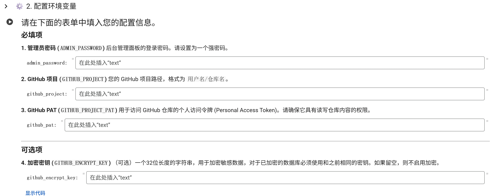
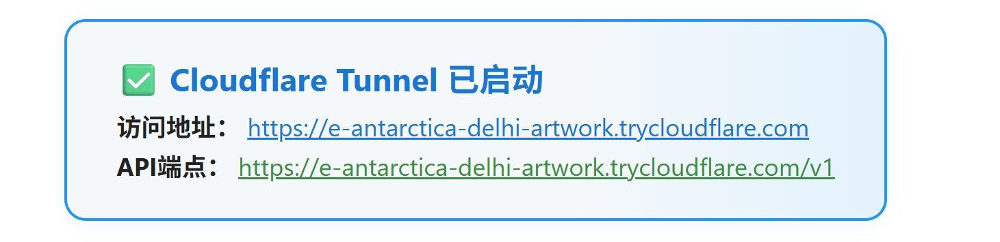
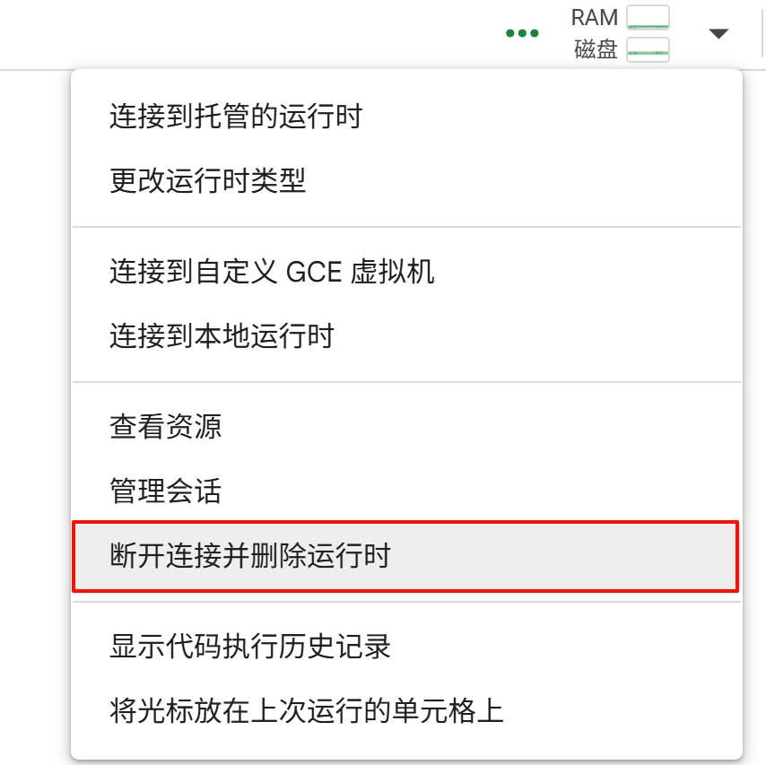

# Colab 部署

此部署方式利用 Colab 的 Notebook 环境运行，并**强制要求启用 GitHub 同步**功能以实现数据持久化。

注意，由于 Colab 的特性，此部署方式无法做到持续运行，每次运行后退出网页，实例最长运行90分钟。但此方法拥有以下显著优点：

* 无门槛，只要有 Google 帐号即可使用
* 部署简单，通过笔记本一键部署运行
* 最大化利用 GitHub 同步功能，实现数据的持久保存

1. **准备 GitHub 仓库和 PAT (必须)**:
   
   * 你需要一个**自己的** GitHub 仓库来存储同步的数据。建议使用私有仓库。
   * 创建一个 GitHub Personal Access Token (PAT)，并确保勾选了 `repo` 权限范围。**请妥善保管此 Token**。
   * 具体操作步骤详见[GitHub配置同步教程](../GitHub/GitHub同步.md)

2. **保存 Colab 笔记本**:

   * 点击打开笔记本。
   * 点击左上角的`复制到云端硬盘`，这将在您自己的 Google Drive 中创建一个副本。
     
   * 页面将进行跳转，确认新的笔记本名称为`“colab启动.ipynb”的副本`，您可以自行修改名称。
     

3. **填写环境变量**:

   * 在您自己的笔记本中，来到`配置环境变量`代码单元，在表单中根据说明填写您的配置信息。
     
   * 在表单中填写必填项，包括管理员密码、GitHub 项目路径和 PAT。
   * 如果需要，可以填写可选项，包括加密密钥。
   * 填写的配置信息会自动保存，下次启动时无需再次填写。

4. **运行笔记本**:

   * 确认所有配置无误后，点击`全部运行`按钮，即可启动面板。
     
   * 在`启动面板`代码单元的输出中可以找到Cloudflare Tunnel的临时地址，点击即可访问后台UI。
     

5. **持续运行与结束**:

   * Colab 实例在未操作的情况下最长运行90分钟，您可以关闭网页(不要结束运行)，实例会继续运行。
   * 如果需要保持运行，可以在保持网页开启的情况下最长运行12小时。
   * 当需要结束运行时，点击右上角的`断开连接并删除运行时`。
     
   * 填写的信息会自动保存，下次使用时访问[Google Colab](https://colab.research.google.com/)选择之前保存的笔记本，无须输入即可直接`全部运行`，每次连接时仅需要替换新的临时地址即可。

6. **在后台中进行设置**

   * 在后台UI中进行配置 Api 连接，详细请参考[配置API连接教程](../../Usage/配置API连接.md)。
