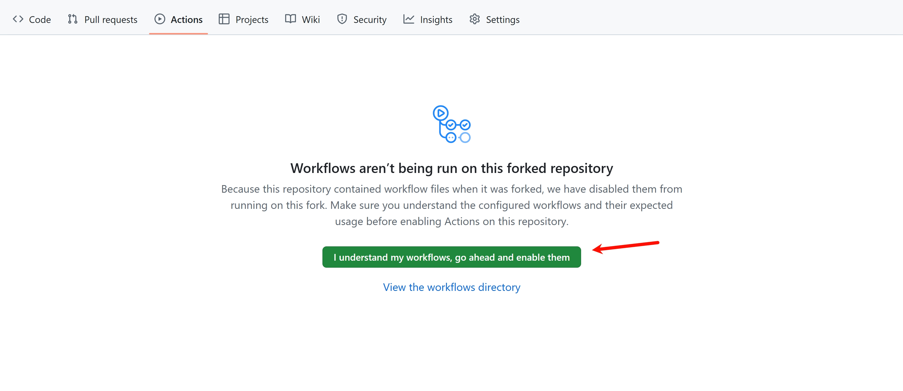
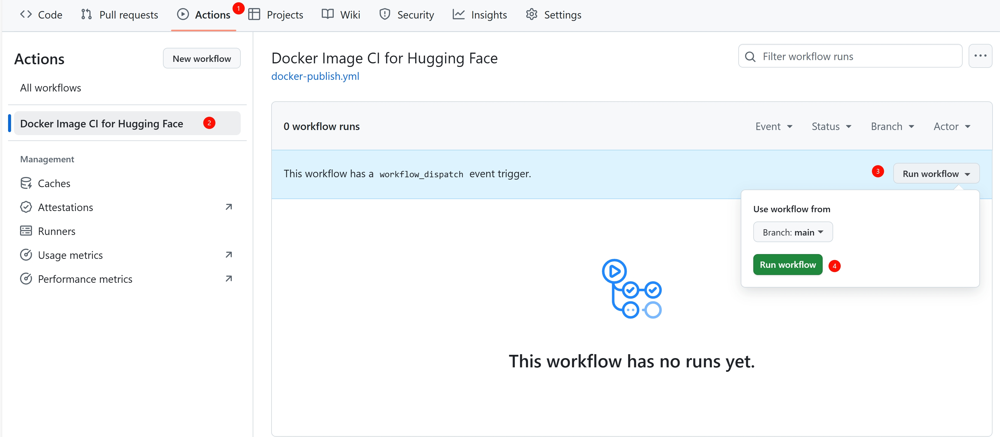
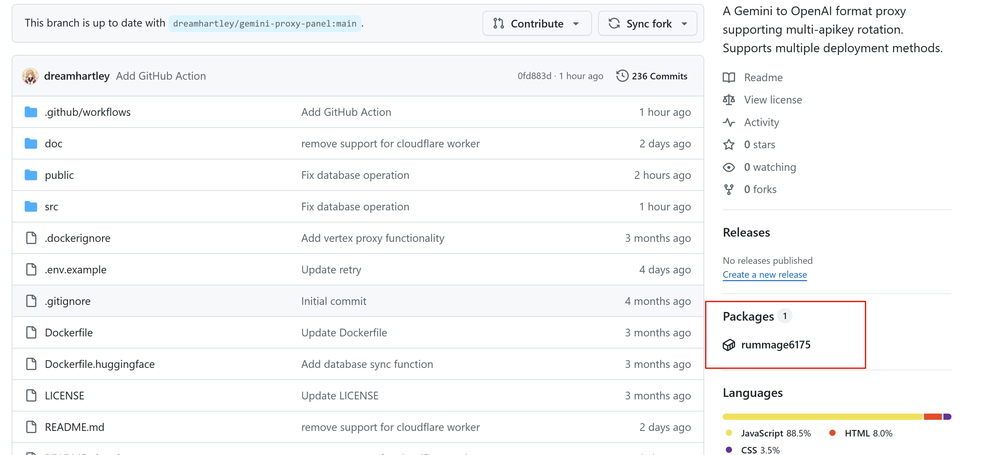
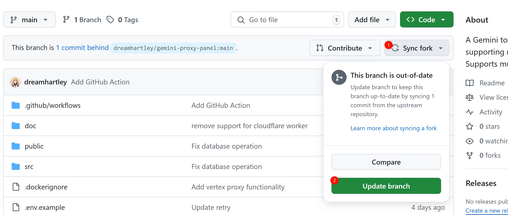

# Hugging Face Space部署出现问题的应对

由于本项目在Hugging Face Space中部署较多，疑似被官方封禁，直接拉取项目镜像可能会导致部署失败或Space被停用，如果您在使用中遇到类似的问题，请参考以下的步骤Fork项目并创建自己的镜像：

1. **创建GitHub仓库Fork**
   - 创建Fork [dreamhartley/JimiHub](https://github.com/dreamhartley/JimiHub/fork)
   - 确保使用自定义的仓库名称，**不要包含** `JimiHub`或`hajimi`等关键词

2. **启用工作流**
   - 在上方Actions标签栏，点击`I understand my workflows, go ahead and enable them`按钮
     

3. **运行Docker镜像构建工作流**
   - 在左侧边栏选择`Docker Image CI for Hugging Face`
   - 在右侧点击`Run workflow`
     

4. **获取镜像地址**
   - 等待运行完成
   - 在Fork的仓库页面，点击Packages中创建的镜像
     
   - 复制镜像地址

5. **创建Huggingface Space**
   - 在Huggingface Space创建Dockerfile
   - 内容填写：`FROM ghcr.io/GitHub用户名/Fork仓库名:latest`
   - 替代原本教程中提供的镜像地址，其余步骤不变

## 更新部署

如果通过fork仓库创建镜像后部署在Huggingface Space的用户需要更新：

1. 在fork的仓库页面点击`Sync fork`-->`Update branch`

2. 等待Actions自动运行完成后会创建新的镜像
3. 在Space页面点击`Settings`-->`Factory rebuild`即可