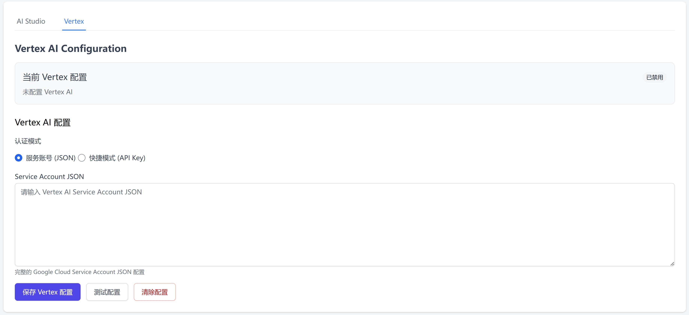
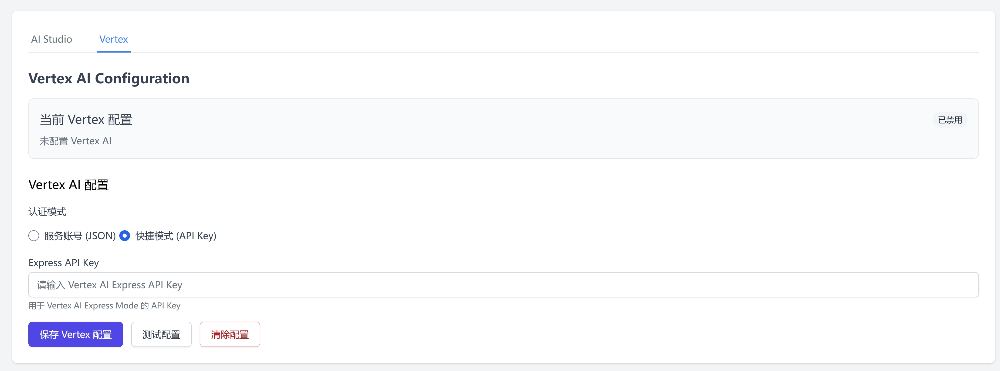
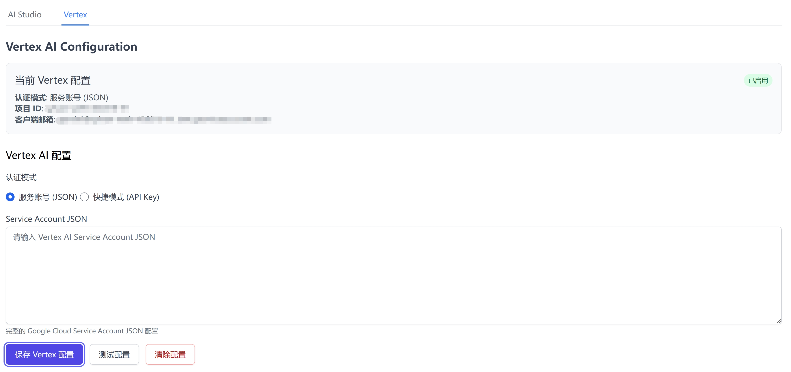
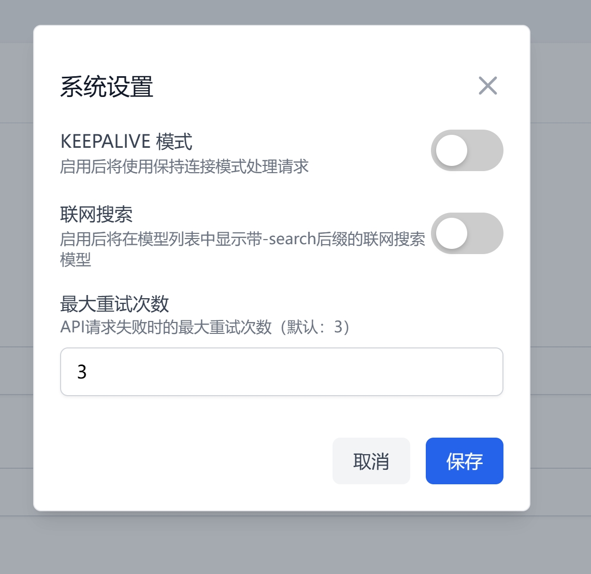

# 在管理UI中配置API连接

## 添加 AI Studio 密钥

 * 在 `Gemini API Keys` 界面中的 `API Key Value` 中填写并添加 Gemini Api 密钥，可选择批量进行添加，批量添加时使用英文逗号 `,` 进行分隔，例如 `key1,key2,kye3`。在使用批量添加功能时请不要添加自定义名称功能。自定义名称可留空。
 

## 添加一个模型

 * 在 `Managed Models` 界面中添加想要使用的模型，当正确添了 Gemini Api 密钥后，刷新页面，脚本将自动获取当前可用的模型列表。
 
 * 您可以选择在类别中切换模型的类别以匹配不同的额度，当然，大多数情况下脚本可用做到自动匹配。
 
 * 当使用 Custom 类别的模型时，您可用输入一个基于模型的额度，Custom 类别中的每个模型的额度都会被独立管理。设置 `0` 或 `none` 表示无限额度。
 

## 添加一个请求 Api 密钥
除了添加的 Gemini Api 外，您还需要添加用于请求到当前脚本的 Api 密钥。
 * 在 `Worker API Keys` 界面中添加密钥，点击 `Generate Random Key` 可用使用随机生成的密钥，或者您可以自行填写密钥，注意密钥中不要包含特殊字符。密钥的名称可自定义或留空。
 
 * 您可用管理或分发多个 Api 密钥，该密钥为客户端请求时使用的密钥。

## 测试 Gemini Api 密钥的可用性
当正确配置 Gemini Api 密钥以及添加模型后，您可用点击密钥的显示卡片展开密钥使用情况，点击 `Test` 并选择一个测试模型即可快速测试密钥的可用性。

## 管理安全设置
使用本项目可用管理请求密钥在使用时的安全设定，当安全设定为 `Disabled` 时，将在转发 Gemini Api 请求时关闭默认的安全审查机制。您可以给不同的请求密钥设置不同的安全设定以适配不同的使用环境。当使用 `KEEPALIVE` 机制进行伪流式请求时需要关闭安全设定才会生效。

## 管理配额
在 `Managed Models` 界面点击 `Set Category Quotas`，可以设定 Pro 与 Flash 类别模型不同的每日额度。默认额度为 Pro 每天 50 次，Flash 每天 1500 次，请根据实际情况进行调整。

## 添加 Vertex 配置
本项目支持连接到Vertex AI平台的Gemini模型，Vertex配置的申请操作请参考：[Vertex代理配置](Vertex/Vertex代理配置.md)

切换到Vertex标签后即可在网页中配置Vertex Api，支持两种方式连接到Vertex Api
#### 服务账号 (JSON)
- 选择`服务账号 (JSON)`并在输入框填写完整的 Google Cloud Service Account JSON 配置，点击`保存 Vertex 配置`即可保存服务账号信息。
   
#### 快捷模式 (API Key)
- 选择`快捷模式 (API Key)`并在输入框填写Express API Key，点击`保存 Vertex 配置`即可保存快捷模式密钥。
   
#### 配置完成
保存Vertex配置后，网页将会显示使用的Vertex配置信息，并且显示为`已启用`，此时连接到api端点即可使用带有`[v]`前缀的模型连接到Vertex Api。
再次添加配置会覆盖当前的Vertex配置信息，点击`清除配置`将会删除保存的Vertex配置信息并停用Vertex代理功能。

## 其他系统设置
点击网页右上角的设置按钮，即可调整其他的一些系统功能

- **KEEPALIVE**：启用后可以使用保持连接方式处理请求，也被成为假流式，具体使用请参考[KEEPALIVE模式介绍](KEEPALIVE.md)
- **联网搜索**：默认关闭，启用后将会在模型列表中添加`-search`后缀的模型，使用时将会允许模型通过互联网搜索信息，暂时仅对AI Studio的模型生效。
- **最大重试次数**：请求失败后将会自动使用下一个有效的gemini api密钥重试请求，在此处修改允许重试的最大次数。
